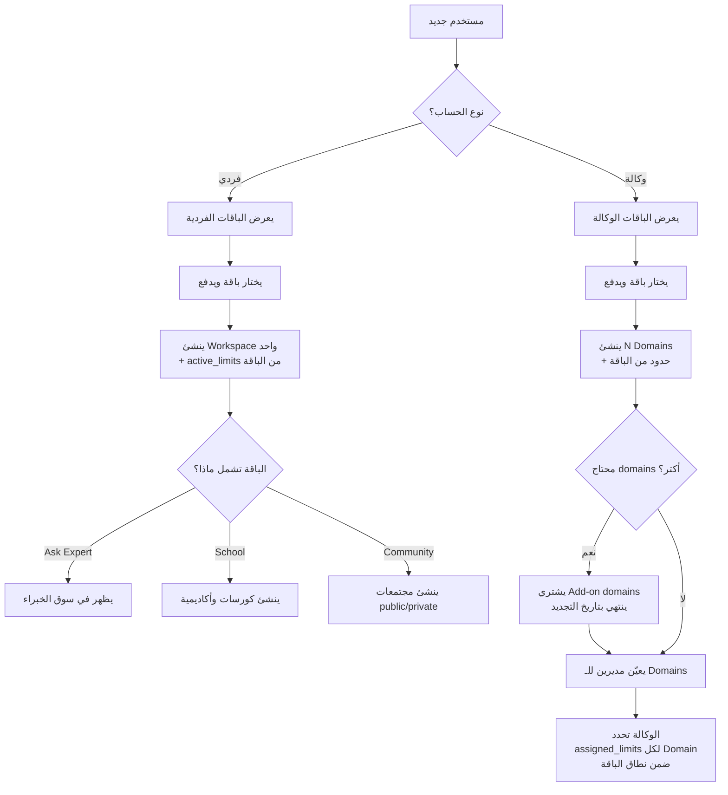
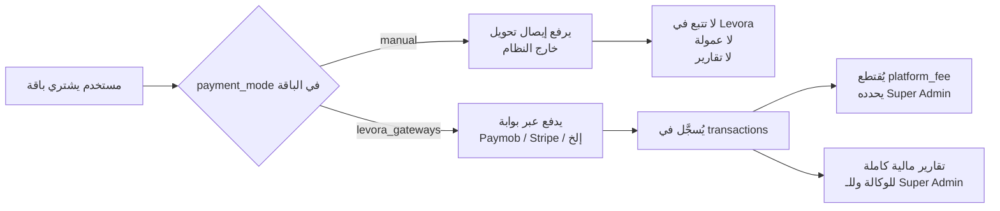

# تصميم نظام الحسابات والباقات — Levora

**التاريخ:** 2026-04-29
**الحالة:** مكتمل — جاهز للمراجعة قبل كتابة خطة التنفيذ

---

## 1) نظرة عامة على النظام

Levora تدعم **نوعين رئيسيين من الحسابات** مع نظام باقات مرن يتحكم فيه Super Admin بالكامل.

```
Levora Platform
├── حساب فردي (Individual)
│   ├── يختار باقة فردية
│   ├── يحصل على Workspace واحد
│   └── ميزات: Ask Expert + School + Community (حسب الباقة)
│
└── حساب وكالة (Agency)
    ├── يختار باقة وكالة
    ├── يحصل على N Domains (workspaces)
    ├── يوزع Domains على مديرين
    ├── يحدد حدود كل Domain ضمن نطاق الباقة
    └── ميزات: School + Community فقط (Ask Expert حصري للفرد)
```

---

## 2) أنواع الحسابات بالتفصيل

### 2-A. الحساب الفردي

| البند | التفصيل |
|-------|---------|
| طريقة التسجيل | مباشرة على Levora |
| الـ Workspace | واحد فقط |
| الميزات المتاحة | Ask Expert + School + Community (أي تركيبة حسب الباقة) |
| Ask Expert | حصري على Levora الرئيسية |
| ما يستطيع فعله | بناء أكاديمية، مجتمعات، تقديم استشارات |

### 2-B. حساب الوكالة

| البند | التفصيل |
|-------|---------|
| طريقة التسجيل | مباشرة على Levora |
| الـ Domains | عدد محدد في الباقة + إضافات قابلة للشراء |
| الميزات المتاحة | School + Community فقط على كل Domain |
| Ask Expert | غير متاح على Sub-domains |
| ما تستطيع فعله | تخصيص Domains للمديرين مع تحديد حدود مخصصة لكل Domain |

---

## 3) هيكل الباقات (Admin-Configured)

### 3-A. ما يُحدِّده Super Admin في كل باقة

```
Package Configuration
├── معلومات أساسية
│   ├── name, description
│   ├── price, billing_cycle (monthly|quarterly|yearly|lifetime|custom)
│   ├── type: individual | agency
│   ├── is_active
│   └── payment_mode: manual | levora_gateways
│
├── الميزات المُفعَّلة (Feature Toggles)
│   ├── ask_expert: true/false    ← للفرد فقط
│   ├── school: true/false
│   └── communities: true/false
│
├── نطاق الحدود (Limit Ranges) — min/max لكل حد
│   ├── school.max_courses:        { min, max }
│   ├── school.max_students:       { min, max }
│   ├── communities.max_total:     { min, max }
│   ├── communities.max_public:    { min, max }
│   ├── communities.max_private:   { min, max }
│   └── ask_expert.max_sessions_per_month: { min, max }
│
└── خاص بالوكالة فقط
    ├── included_domains       عدد الـ Domains في الباقة الأساسية
    └── addon_domain_price     سعر كل Domain إضافي
```

### 3-B. مثال باقة فردية

```json
{
  "name": "Growth",
  "type": "individual",
  "price": 79,
  "billing_cycle": "monthly",
  "payment_mode": "levora_gateways",
  "feature_toggles": {
    "ask_expert": true,
    "school": true,
    "communities": true
  },
  "limit_ranges": {
    "school": { "max_courses": {"min": 1, "max": 50}, "max_students": {"min": 10, "max": 500} },
    "communities": { "max_total": {"min": 1, "max": 10}, "max_public": {"min": 0, "max": 5} },
    "ask_expert": { "max_sessions_per_month": {"min": 0, "max": 100} }
  }
}
```

### 3-C. مثال باقة وكالة

```json
{
  "name": "Agency Pro",
  "type": "agency",
  "price": 299,
  "billing_cycle": "monthly",
  "payment_mode": "levora_gateways",
  "feature_toggles": {
    "ask_expert": false,
    "school": true,
    "communities": true
  },
  "limit_ranges": {
    "school": { "max_courses": {"min": 1, "max": 100}, "max_students": {"min": 10, "max": 1000} },
    "communities": { "max_total": {"min": 1, "max": 50}, "max_public": {"min": 0, "max": 20} }
  },
  "included_domains": 5,
  "addon_domain_price": 25
}
```

---

## 4) نظام الحدود المزدوج (Two-Level Limits)

```
Super Admin يحدد النطاق (Range)
    ↓
package.limit_ranges = { max_courses: { min: 1, max: 100 } }

الوكالة تُخصِّص لكل Domain ضمن النطاق
    ↓
workspace.assigned_limits = { max_courses: 15 }  ← يجب أن يكون بين 1 و 100

قبل أي عملية إنشاء — طبقة التحقق (LimitsService)
    ↓
current_courses < workspace.assigned_limits.max_courses ← مسموح
```

**للحساب الفردي:** الحدود الفعلية = الحد الأقصى من `limit_ranges.max` مباشرة (لا تدخل من وسيط).

---

## 5) نظام الإضافات (Add-ons)

### المبدأ
بدلاً من شراء باقة جديدة أكبر، المستخدم يشتري **add-on** يُضاف فوق باقته ويظل فعّالاً حتى تاريخ التجديد.

### قواعد Add-ons

| القاعدة | التفصيل |
|---------|---------|
| التراكم | يمكن شراء عدد غير محدود من الإضافات في نفس الدورة |
| تاريخ الانتهاء | `valid_until = subscription.ends_at` عند وقت الشراء |
| التجديد التلقائي | لا — المستخدم يقرر عند التجديد |
| السعر | يُحدده الأدمن (ثابت أو prorated) |

### حساب الحدود الفعلية

```
effective_domains = package.included_domains
                  + SUM(subscription_addons.quantity WHERE valid_until >= NOW())
```

### مثال عملي

```
وكالة — باقة أساسية: 5 domains — تنتهي 2026-08-01
│
├── Add-on شراء أبريل:  +3 domains → المجموع = 8 (ينتهي 2026-08-01)
├── Add-on شراء مايو:   +2 domains → المجموع = 10 (ينتهي 2026-08-01)
└── عند التجديد: الإضافات لا تُجدَّد — المستخدم يختار
```

---

## 6) تدفق التسجيل والاشتراك



---

## 7) تدفق الدفع



---

## 8) تصميم قاعدة البيانات الكامل

### جداول رئيسية

```
packages
├── id
├── name, description
├── type                enum: individual | agency
├── price               decimal(10,2)
├── billing_cycle       enum: monthly | quarterly | yearly | lifetime | custom
├── custom_days         int nullable
├── payment_mode        enum: manual | levora_gateways
├── feature_toggles     json   { ask_expert, school, communities }
├── limit_ranges        json   { field: { min, max } }
├── included_domains    int default 0     ← للوكالة فقط
├── addon_domain_price  decimal(10,2)     ← للوكالة فقط
├── is_active           boolean
└── sort_order          int
```

```
package_addons          ← أنواع الإضافات المتاحة لكل باقة
├── id
├── package_id          → packages.id
├── addon_type          enum: domains | extra_courses | extra_students | extra_communities
├── quantity_per_unit   int        (كم وحدة per add-on purchase)
├── price               decimal(10,2)
├── description         string
└── is_active           boolean
```

```
users
├── id
├── name, email, password
├── account_type        enum: individual | agency
└── timestamps
```

```
subscriptions
├── id
├── user_id             → users.id
├── package_id          → packages.id
├── status              enum: active | expired | cancelled | past_due
├── starts_at, ends_at
├── auto_renew          boolean default true
└── timestamps
```

```
subscription_addons     ← الإضافات المشتراة في دورة اشتراك معينة
├── id
├── subscription_id     → subscriptions.id
├── addon_id            → package_addons.id
├── quantity            int    (عدد الوحدات المشتراة)
├── amount_paid         decimal(10,2)
├── purchased_at        timestamp
└── valid_until         timestamp    (= subscription.ends_at عند الشراء)
```

```
workspaces              ← Workspace فردي أو Domain في وكالة
├── id
├── owner_id            → users.id   (الفرد أو الوكالة)
├── subscription_id     → subscriptions.id
├── type                enum: individual | agency_domain
├── domain              string unique
├── enabled_features    json   { ask_expert, school, communities }
├── assigned_limits     json   { field: value }   ← تحدده الوكالة ضمن نطاق الباقة
└── timestamps
```

```
transactions            ← فقط عند payment_mode = levora_gateways
├── id
├── workspace_id        → workspaces.id
├── subscription_id     → subscriptions.id
├── amount_gross        decimal(10,2)
├── platform_fee        decimal(10,2)
├── amount_net          decimal(10,2)
├── gateway             string   (paymob | stripe | moyasar | ...)
├── gateway_tx_id       string
├── status              enum: pending | completed | refunded | failed
└── created_at
```

---

## 9) طبقة التحقق من الحدود (LimitsService)

كل عملية إنشاء تمر عبر `LimitsService::check()` قبل التنفيذ:

```
رفع كورس جديد
→ LimitsService::check(workspace_id, 'school.max_courses')
→ current_courses < workspace.assigned_limits.school.max_courses ✅

إنشاء مجتمع public
→ LimitsService::check(workspace_id, 'communities.max_public')
→ current_public < workspace.assigned_limits.communities.max_public ✅

إضافة Domain (Agency)
→ LimitsService::check(subscription_id, 'domains')
→ used_domains < effective_domains ✅
   حيث effective_domains = package.included_domains
                          + SUM(active subscription_addons)
```

---

## 10) جدول القرارات المؤكدة

| القرار | النتيجة |
|--------|---------|
| أنواع الحسابات | فردي + وكالة |
| Ask Expert | حصري على الفرد على Levora الرئيسية |
| تكوين الباقة | Admin يحدد الميزات + نطاق (min/max) لكل حد |
| حدود الـ Domains | الوكالة تخصص لكل Domain ضمن النطاق |
| Add-ons | تتراكم، تنتهي بتجديد الباقة، لا تتجدد تلقائياً |
| نموذج الدفع | Admin يحدد في الباقة: Manual أو Levora Gateways |
| نسبة المنصة | Super Admin يحدد % على بوابات Levora فقط |
| فروع الباقات الإضافية | بدلاً من ترقية كاملة — add-ons حتى نهاية دورة الاشتراك |
